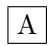

# All Features Small

## May 3, 2026

## 1 All

## 1.1 AllSub

Figure 1: Boxed figure

Table 1: Sample table

$$
E = m c ^ { 2 }\tag{1}
$$

one

1. sub

1 ref 1 1.1 1 1 1.

## 2 References

[1] Item.