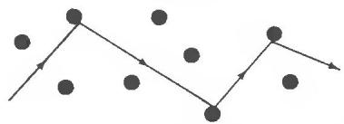

Drude applied kinetic theory to this "gas" of conduction electrons of mass m, which (in contrast to the molecules of an ordinary gas) move against a background of heavy immobile ions. The density of the electron gas can be calculated as follows:

A metallic element contains $0 . 6 0 2 2 \times 1 0 ^ { 2 4 }$ atoms per mole (Avogadro's number) and $\rho _ { m } / A$ moles per $\mathrm { c m } ^ { 3 }$ ,where $\rho _ { m }$ is the mass density (in grams per cubic centimeter) and A is the atomic mass of the element. Since each atom contributes Z electrons, the number of electrons per cubic centimeter, $n = N / V ,$ is

$$
n = 0 . 6 0 2 2 \times 1 0 ^ { 2 4 } \frac { Z \rho _ { m } } { A } .\tag{1.1}
$$

Table 1.1 shows the conduction electron densities for some selected metals, They are typically of order $1 0 ^ { 2 2 }$ conduction electrons per cubic centimeter, varying from $0 . 9 1 \ \times \ 1 0 ^ { 2 2 }$ for cesium up to $2 4 . 7 \times 1 0 ^ { 2 2 }$ for beryllium. Also listed in Table 1.1 is a widely used measure of the electronic density. $r _ { s * }$ defined as the radius of a sphere whose volume is equal to the volume per conduction electron. Thus

$$
\frac { V } { N } = \frac { 1 } { n } = \frac { 4 \pi { r _ { s } } ^ { 3 } } { 3 } ; ~ r _ { s } = { \left( \frac { 3 } { 4 \pi n } \right) } ^ { 1 , 3 } .\tag{1.2}
$$

Table 1.1 lists $r _ { s }$ both in angstroms $( 1 0 ^ { - 8 }$ cm) and in units of the Bohr radius $a _ { 0 } =$ $\hbar ^ { 2 } / m e ^ { 2 } = 0 . 5 2 9 \times 1 0 ^ { - 8 }$ cm; the latter length, being a measure of the radius of a hydrogen atom in its ground state, is often used as a scale for measuring atomic distances. Note that $r _ { s } / a _ { 0 }$ is between 2 and 3 in most cases, although it ranges between 3 and 6 in the alkali metals (and can be as large as 10 in some metallic compounds).

These densities are typically a thousand times greater than those of a classical gas at normal temperatures and pressures. In spite of this and in spite of the strong electron-electron and electron-ion electromagnetic interactions, the Drude model boldly treats the dense metallic electron gas by the methods of the kinetic theory of a neutral dilute gas, with only slight modifications. The basic assumptions are these:

1. Between collisions the interaction of a given electron, both with the others and with the ions, is neglected. Thus in the absence of externally applied electromagnetic fields each electron is taken to move uniformly in a straight line. In the presence of externally applied fields each electron is taken to move as determined by Newton's laws of motion in the presence of those external fields, but neglecting the additional complicated fields produced by the other electrons and ions.6 The neglect of electron-electron interactions between collisions is known as the independent electron approximation. The corresponding neglect of electron-ion interactions is known as the free electron approximation. We shall find in subsequent chapters that although the independent electron approximation is in many contexts surprisingly good, the free electron approximation must be abandoned if one is to arrive at even a qualitative understanding of much of metallic behavior.

Table 1.1  
FREE ELECTRON DENSITIES OF SELECTED METALLIC ELE-MENTSa
<table><tr><td>ELEMENT</td><td>Z</td><td> $n ( 1 0 ^ { 2 2 } / { \mathrm { c m } } ^ { 3 } )$ </td><td> $r _ { s } ( \mathrm { \AA } )$ </td><td> $r _ { s } / a _ { 0 }$ </td></tr><tr><td>Li (78 K)</td><td>1</td><td>4.70</td><td>1.72</td><td>3.25</td></tr><tr><td>Na (5 K)</td><td>1</td><td>2.65</td><td>2.08</td><td>3.93</td></tr><tr><td>K (5 K)</td><td>I</td><td>1.40</td><td>2.57</td><td>4.86</td></tr><tr><td>Rb (5 K)</td><td>1</td><td>1.15</td><td>2.75</td><td>5.20</td></tr><tr><td>Cs (5 K)</td><td>I</td><td>0.91</td><td>2.98</td><td>5.62</td></tr><tr><td>Cu</td><td>I</td><td>8.47</td><td>1.41</td><td>2.67</td></tr><tr><td>Ag</td><td>1</td><td>5.86</td><td>1.60</td><td>3.02</td></tr><tr><td>Au</td><td>1</td><td>5.90</td><td>1.59</td><td>3.01</td></tr><tr><td>Be</td><td>2</td><td>24.7</td><td>0.99</td><td>1.87</td></tr><tr><td>Mg</td><td>20</td><td>8.61</td><td>1.41</td><td>2.66</td></tr><tr><td>Ca</td><td>2</td><td>4.61</td><td>1.73</td><td>3.27</td></tr><tr><td>Sr</td><td>2</td><td>3.55</td><td>1.89</td><td>3.57</td></tr><tr><td>Ba</td><td>2</td><td>3.15</td><td>1.96</td><td>3.71</td></tr><tr><td>Nb</td><td>1</td><td>5.56</td><td>1.63</td><td>3.07</td></tr><tr><td>Fe</td><td>2</td><td>17.0</td><td>1.12</td><td>2.12</td></tr><tr><td>Mn (x)</td><td>2</td><td>16.5</td><td>1.13</td><td>2.14</td></tr><tr><td>Zn</td><td></td><td>13.2</td><td>1.22</td><td>2.30</td></tr><tr><td>Cd</td><td>22</td><td>9.27</td><td>1.37</td><td>2.59</td></tr><tr><td>Hg (78 K)</td><td>2</td><td>8.65</td><td>1.40</td><td>2.65</td></tr><tr><td>Al</td><td>3</td><td>18.1</td><td>1.10</td><td>2.07</td></tr><tr><td>Ga</td><td>3</td><td>15.4</td><td>1.16</td><td>2.19</td></tr><tr><td>In</td><td>3</td><td>11.5</td><td>1.27</td><td>2.41</td></tr><tr><td>T1</td><td>3</td><td>10.5</td><td>1.31</td><td>2.48</td></tr><tr><td>Sn</td><td>4</td><td>14.8</td><td>1.17</td><td>2.22</td></tr><tr><td>Pb</td><td>4</td><td>13.2</td><td>1.22</td><td>2.30</td></tr><tr><td>Bi</td><td>5</td><td>14.1</td><td>1.19</td><td>2.25</td></tr><tr><td>Sb</td><td>5</td><td>16.5</td><td>1.13</td><td>2.14</td></tr></table>

At room temperature (about 300 K) and atmospheric pressure, unless otherwise noted. The radius $r _ { s }$ othe free electron sphere is defined in Eq (1.). We have arbitrarily selected one value of Z for those elements that display more than one chemical valence. The Drude model gives no theoretical basis for the choice. Values of n are based on data from R. W. G. Wyckoff, Crystal Structures, 2nd ed., Interscience, New York, 1963.

2. Collisions in the Drude model, as in kinetic theory, are instantaneous events that abruptly alter the velocity of an electron. Drude attributed them to the electrons bouncing off the impenetrable ion cores (rather than to electron-electron collisions. the analogue of the predominant collision mechanism in an ordinary gas). We shall find later that electron-electron scattering is indeed one of the least important of the several scattering mechanisms in a metal, except under unusual conditions. However,

  
Figure 1.2

Trajectory of a conduction electron scattering off the ions. according to the naive picture of Drude.

the simple mechanical picture (Figure 1.2) of an electron bumping along from ion to ion is very far off the mark.7 Fortunately, this does not matter for many purposes: a qualitative (and often a quantitative) understanding of metallic conduction can be achieved by simply assuming that there is some scattering mechanism, without inquiring too closely into just what that mechanism might be. By appealing, in our analysis. to only a few general effects of the collision process. we can avoid committing ourselves to any specific picture of how electron scattering actually takes place. These broad features are described in the following two assumptions.

3. We shall assume that an electron experiences a collision (i.e. suffers an abrupt change in its velocity) with a probability per unit time 1/τ. We mean by this that the probability of an electron undergoing a collision in any infinitesimal time interval of length dt is just dt/t. The time t is variously known as the relaxation time, the collision time, or the mean free time, and it plays a fundamental role in the theory of metallic conduction. It follows from this assumption that an electron picked at random at a given moment will, on the average, travel for a time t before its next collision, and will, on the average, have been traveling for a time t since its last collision.8 In the simplest applications of the Drude model the collision time t is taken to be independent of an electron's position and velocity. We shall see later that this turns out to be a surprisingly good assumption for many (but by no means all) applications. 4. Electrons are assumed to achieve thermal equilibrium with their surroundings only through collisions. These collisions are assumed to maintain local thermodynamic equilibrium in a particularly simple way: immediately after each collision an electron is taken to emerge with a velocity that is not related to its velocity just before the collision, but randomly directed and with a speed appropriate to the temperature prevailing at the place where the collision occurred. Thus the hotter the region in which a collision occurs, the faster a typical electron will emerge from the collision.

In the rest of this chapter we shall illustrate these notions through their most important applications, noting the extent to which they succeed or fail to describe the observed phenomena.

## DC ELECTRICAL CONDUCTIVITY OF A METAL

According to Ohm's law, the current I flowing in a wire is proportional to the potential drop V along the wire: V = IR, where R, the resistance of the wire, depends on its dimensions, but is independent of the size of the current or potential drop. The Drude model accounts for this behavior and provides an estimate of the size of the resistance.

One generally eliminates the dependence of R on the shape of the wire by introducing a quantity characteristic only of the metal of which the wire is composed. The resistivity $\rho$ is defined to be the proportionality constant between the electric field E at a point in the metal and the current density j that it induces10.

$$
{ \bf E } = \rho { \bf j } .\tag{1.3}
$$

The current density j is a vector. parallel to the flow of charge, whose magnitude is the amount of charge per unit time crossing a unit area perpendicular to the flow. Thus if a uniform current I fows through a wire of length L and cross-sectional area A, the current density will be $j = I , A$ Since the potential drop along the wire will be $V = E L$ , Eq. (1.3) gives $V = I \rho L / . 4 .$ ,and hence $R = \rho L / A$

If n electrons per unit volume all move with velocity v, then the current density they give rise to will be parallel to v. Furthermore, in a time dt the electrons will advance by a distance v dt in the direction of v, so that $n ( \tau d t ) A$ electrons will cross an area A perpendicular to the direction of flow. Since each electron carries a charge $- e ,$ the charge crossing 4 in the time dt will be $- n e t A d t ,$ and hence the current density is

$$
{ \bf j } = - n e { \bf v } .\tag{1.4}
$$

At any point in a metal, electrons are always moving in a variety of directions with a variety of thermal energies. The net current density is thus given by (1.4), where v is the average electronic velocity. In the absence of an electric field, electrons are as likely to be moving in any one direction as in any other, v averages to zero, and, as expected, there is no net electric current density. In the presence of a field E, however, there will be a mean electronic velocity directed opposite to the feld (the electronic charge being negative), which we can compute as follows:

Consider a typical electron at time zero. Let t be the time elapsed since its last collision. Its velocity at time zero will be its velocity $\Psi _ { 0 }$ immediately after that collision plus the additional velocity $- e \mathbf { E } t / m$ it has subsequently acquired. Since we assume that an electron emerges from a collision in a random direction, there will be no contribution from ${ \bf v } _ { 0 }$ to the average electronic velocity, which must therefore be given entirely by the average of $- e \mathbf { E } t / m$ However, the average of t is the relaxation time . Therefore

$$
\mathbf { \boldsymbol { \nu } } _ { \mathrm { a v g } } = - \ \frac { e \mathbf { E } \tau } { m } ; ~ \mathbf { \ j } = \left( \frac { n e ^ { 2 } \tau } { m } \right) \mathbf { \boldsymbol { \mathbf { E } } } .\tag{1.5}
$$

This result is usually stated in terms of the inverse of the resistivity, the conductivity $\sigma = 1 / \rho ;$

$$
\boxed { \begin{array} { l l } { \mathbf { j } = \sigma \mathbf { E } ; } & { \sigma = \frac { n e ^ { 2 } \tau } { m } . } \end{array} }\tag{1.6}
$$